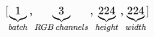
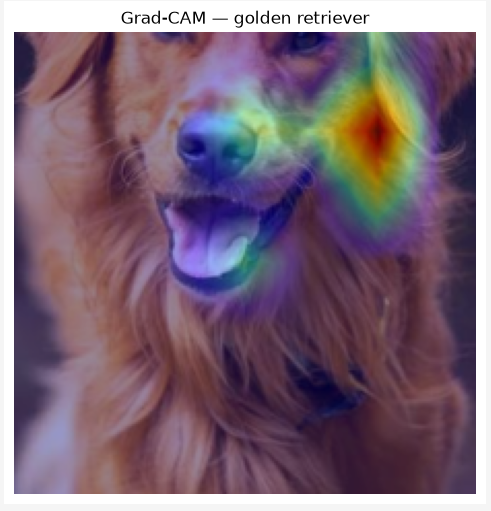

# Grad-CAM from Scratch: Paper Reproduction

## Overview

This repository is a reproduction of the paper Grad-CAM: Visual Explanations from Deep Networks via Gradient-based Localization. The Grad-CAM method was implemented from scratch to obtain the class-discriminative localization map built by weighting feature maps according to their importance for the target class score. The method was implemented step by step from the equations stated in the paper. I used the pre-trained ResNet50 with ImageNet to understand how Grad-CAM works internally, and the implementation was validated against the pytorch-grad-cam reference implementation.

## Paper

> Selvaraju, R. R., Cogswell, M., Das, A., Vedantam, R., Parikh, D., & Batra, D. (2017).  
> [*Grad-CAM: Visual Explanations from Deep Networks via Gradient-based Localization*](https://arxiv.org/abs/1610.02391).  
> Proceedings of the IEEE International Conference on Computer Vision (ICCV).

CNNs achieve strong performance but their predictions are difficult to interpret, this makes failures/biases harder to understand, so Grad-CAM provides spatial information about which regions contribute to a particular class.

## Objective of this reproduction

## Method
### 1. Model and input

I used a ResNet50 model pretrained on ImageNet. The model was used only for inference and was not fine-tuned or retrained. The input image was preprocessed using the transformations associated with the pretrained weights. After preprocessing, the image tensor had a shape of `[3, 224, 224]`. `unsqueeze(0)` was used to add the batch dimension to the input tensor because ResNet50 expects its input in batched form, resulting in a shape of `[1, 3, 224, 224]`.

### 2. Target convolutional 

I searched for one of the last convolutional layers of ResNet50 because deep convolutional layers keep spatial information  while they capture high-level semantic carachteristics. I selected model.layer4[2].conv3, which corresponds to the last convolutional layer of the final Bottleneck in layer4. The ouput is [1, 2048, 7, 7], where 2048 are the amount of total feature maps and 7x7 represents the spatial resolution of each feature map.

### 3. Forward pass and target class

I performed a forward pass, obtaining an output with shape [1, 1000], where 1000 corresponds to the number of classes in ImageNet. I used \(c\) to represent the index of the target class and \(y^c\) as the score assigned to that class by the model. Since Grad-CAM is class-discriminative, \(y^c\) is selected so that the gradients can be computed specifically with respect to the score of class \(c\). Following the Grad-CAM formulation, \(y^c\) corresponds to the class score before the softmax operation.

### 4. Capturing feature maps

To capture the activations from the target convolutional layer, I registered a forward hook to capture the output of model.layer4[2].conv3, which I stored in activations. These activations correspond to the feature maps \(A^k\) and are later weighted according to their importance for the target class to build the Grad-CAM localization map. The captured activations had a shape of [1, 2048, 7, 7], corresponding to 2048 feature maps with a spatial resolution of 7x7. 

### **5. Computing Gradients**

After selecting the target class score $y^c$, I performed backpropagation to obtain the gradients of the class score with respect to the activations of the target convolutional layer:

$$
\frac{\partial y^c}{\partial A_{ij}^{k}}
$$

These gradients represent how sensitive the score of class $c$ is to each activation in the feature maps. The resulting gradients have a shape of `[1, 2048, 7, 7]`, the same shape as the activations, because each spatial activation has its corresponding gradient.

### **6. Computing Channel Importance Weights**

After obtaining the gradients, I calculated the importance of each feature map for the target class. Following the Grad-CAM equation, the gradients of each feature map are averaged over its spatial dimensions:

$$
\alpha_k^c =
\frac{1}{Z}
\sum_i \sum_j
\frac{\partial y^c}{\partial A_{ij}^{k}}
$$

Since every feature map has a spatial size of $7 \times 7$, its 49 gradient values are averaged to obtain one importance weight $\alpha_k^c$ for each feature map.

This changes the shape from `[1, 2048, 7, 7]` to `[1, 2048]`, giving one importance weight for each of the 2048 feature maps.

### **7. Building the Grad-CAM Localization Map**

Once the importance weights were calculated, each feature map $A^k$ was multiplied by its corresponding weight $\alpha_k^c$. This gives more influence to the feature maps that are more important for the target class.

The weighted feature maps were then summed across the 2048 channels and ReLU was applied:

$$
L_{\mathrm{Grad-CAM}}^c =
\mathrm{ReLU}\left(
\sum_k \alpha_k^c A^k
\right)
$$

ReLU keeps the positive contributions to the target class and removes the negative values. After summing the 2048 weighted feature maps, the resulting Grad-CAM localization map has a spatial size of $7 \times 7$.

### **8. Visualization**

The $7 \times 7$ Grad-CAM localization map was first normalized between 0 and 1. It was then resized to $224 \times 224$, the same spatial size as the image used as input by ResNet50.

I used bilinear interpolation for the resize because the Grad-CAM output is a continuous heatmap rather than a discrete class mask. Finally, the resized heatmap was overlaid on the input image to visualize which regions had a higher positive contribution to the target class score.

It is important to note that resizing the heatmap from $7 \times 7$ to $224 \times 224$ does not add new spatial information. It only makes the original Grad-CAM map easier to visualize over the input image.

## **Results**

For the first experiment, ResNet50 predicted the input image as a `golden retriever`. The Grad-CAM localization map showed the strongest positive contributions mainly around regions of the dog's face.

The final heatmap was obtained from the original $7 \times 7$ Grad-CAM map and resized to $224 \times 224$ for visualization. The result shows where the model obtained positive evidence for the selected class, but it should not be interpreted as an exact segmentation of the object.

## **Validation**

To verify the implementation, I compared my Grad-CAM result with the `pytorch-grad-cam` reference implementation using the same ResNet50 model, input image, target class, and target convolutional layer.

The first comparison between the final $224 \times 224$ heatmaps produced:

- Mean Absolute Difference (MAE): approximately `0.0012`
- Correlation: approximately `1.0`

Although there was a small numerical difference between the maps, their spatial patterns were almost perfectly correlated.

To investigate this difference, I applied the same min-max normalization to both heatmaps. After using the same normalization, the results were:

- Mean Absolute Difference (MAE): approximately `9.29e-09`
- Maximum difference: approximately `1.79e-07`
- Correlation: approximately `1.0`

This showed that the initial difference was related to scaling or post-processing rather than a meaningful difference in the spatial pattern produced by Grad-CAM.

I also compared the channel importance weights $\alpha_k^c$ calculated by my implementation with the weights calculated from the gradients captured by the reference implementation. Both contained 2048 importance weights and the maximum difference was:

`Alpha max difference: 0.0`

This means that, for this experiment, the calculation of the Grad-CAM channel importance weights was identical between both implementations.

The final validation step will compare the raw $7 \times 7$ Grad-CAM maps before normalization, resizing, colormap application, or overlay. This will allow the core Grad-CAM calculation to be compared independently from the visualization and post-processing steps.

> **Complete raw $7 \times 7$ CAM validation.** 

After comparing the raw Grad-CAM maps from my implementation and pytorch-grad-cam before post-processing, using MAE, maximum difference, and correlation, I can conclude that the small differences observed in the previous comparison were associated with scaling/post-processing of the final maps. For this case, the raw $7 \times 7$ Grad-CAM produced by my implementation matched the raw map reconstructed from the reference implementation exactly (MAE = 0.0, maximum difference = 0.0, correlation = 1.0). This confirms that the core Grad-CAM computation is numerically equivalent to the reference for the tested model, input, target class, and target layer.

### Reference implementation
### Output comparison
### Raw Grad-CAM validation

## Experiments
[pendiente]

## Repository structure

## Installation and usage

## Key takeaways

## References